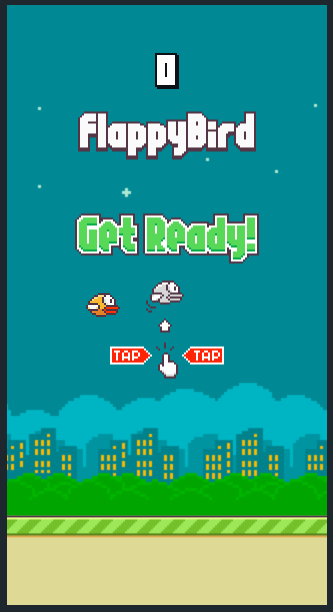

# Flappy Bird Game 🎮
Reimagining the classic **Flappy Bird** game experience in a web-based format! Navigate the bird through endless obstacles, beat high scores, and enjoy the thrill of the original arcade sensation in your browser.

---
## 🕹️ Links

- [Click Here to Play 🐤](https://ashu05g.github.io/FlappyBird_Game/)

---

## 📋 Table of Contents
- [Features](#features)
- [Gameplay](#gameplay)
- [Controls](#controls)
- [Screenshots](#screenshots)
- [Setup & Installation](#setup--installation)
- [Development](#development)
- [Technologies Used](#technologies-used)
- [License](#license)
- [Acknowledgments](#acknowledgments)

---

## 🌟 Features

- **Responsive Gameplay**: Smooth and adaptive visuals across devices.
- **Classic Flappy Bird Mechanics**: Includes gravity, pipe obstacles, and scoring.
- **Audio Effects**: Original sound effects for flapping, scoring, and collisions.
- **Game Over Screen**: Retry easily with a prompt after each round.

---

## 🎮 Gameplay

Guide your bird by flapping to avoid pipes and score points. Each successful pass through a pair of pipes increases your score by one. How high can you score?

### Rules
1. Tap or press to flap and avoid obstacles.
2. Passing between pipes awards points.
3. Collision with a pipe or the ground ends the game.

---

## 🎮 Controls

- **Space Bar** or **Mouse Click** - Make the bird flap.
- **Escape Key** - Pause or restart the game (optional, if implemented).

---

## 📸 Screenshots

### Game Start


### Gameplay


### Game Over


---

## 🛠️ Setup & Installation

### Prerequisites

- **Node.js**: Ensure you have Node.js installed for managing dependencies and running a local server if needed.

### Steps

1. **Clone the repository**:
   ```bash
   git clone https://github.com/ashu05g/FlappyBird_Game.git
   ```
2. **Navigate to the project directory**:
   ```bash
   cd FlappyBird_Game
   ```
3. **Install dependencies** (if applicable):
   ```bash
   npm install
   ```
4. **Build the game**:
   - For local development:
     ```bash
     npm run build
     ```
5. **Start the game**:
   - For local development:
     ```bash
     npm start
     ```
---

## ⚙️ Development

### Project Structure

- **index.html**: Entry point and game interface.
- **index.js**: Main game logic and configuration.
- **styles.css**: Styling for UI elements.
- **game.js**: Core gameplay functions, physics, and event handling.
- **assets/**: Contains images, audio files, and sprites for the game.

### Key Game Mechanics

1. **Physics Engine**: Simulates gravity and flapping movement.
2. **Collision Detection**: Checks for collisions between the bird, pipes, and ground.
3. **Score System**: Tracks player score based on successful navigation through pipes.
4. **Sound Effects**: Engages players with audio feedback.

---

## 🚀 Technologies Used

- **HTML5**: Structure of the game interface.
- **CSS3**: Styling for the UI and game elements.
- **JavaScript (Phaser.js)**: Game development and physics simulation.
- **Webpack**: Bundling assets for optimized loading (optional).

---

## 📜 License

This project is licensed under the MIT License - see the [LICENSE](LICENSE) file for details.

---

## 💬 Acknowledgments

- Inspired by **Flappy Bird**, originally created by Dong Nguyen.
- Sound effects and sprites are either original or modified versions from the open-source community.

---

## 👨‍💻 About the Creator

Created with ❤️ by **Ashutosh Gupta**. Connect on [LinkedIn](https://linkedin.com) or view more of my projects on [GitHub](https://github.com/your-username).

